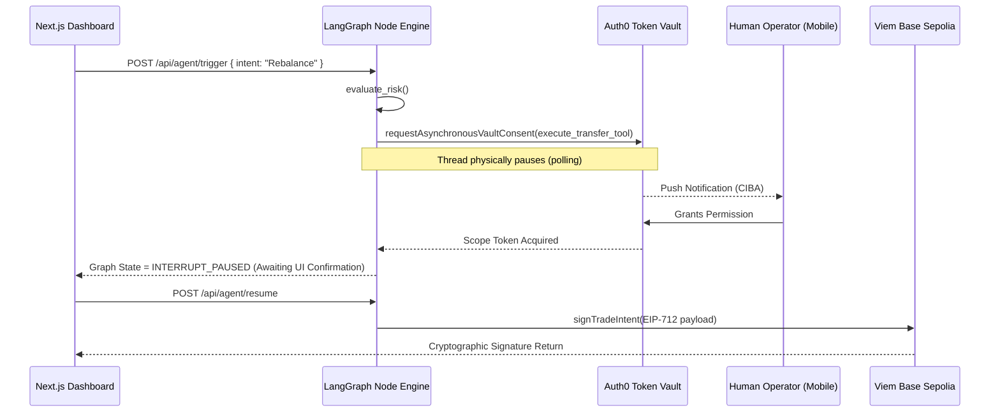

# DeFi Guardian Agent (Auth0 Token Vault Integration)

An institutional-grade autonomous executing agent built on Next.js and **LangGraph.js**. This project features explicit Human-in-the-Loop architectural control secured tightly by the **Auth0 Token Vault**.

## Execution Architecture (LangGraph CIBA Flow)



## Hackathon Judging Criteria Alignment

1. **Security Model**: The agent does not use static API keys. All execution sequences run through the Auth0 Asynchronous Authorization (CIBA) flow.
2. **User Control**: The dashboard utilizes a dedicated `TokenVaultConsent` panel that reads the paused LangGraph state. 
3. **Technical Execution**: Implemented natively in TypeScript using the official `@auth0/ai-langchain` and completely stripped of UI mocks.
4. **Design**: "Bloomberg Terminal" corporate-aesthetic utilizing Tailwind CSS and lucide-react.
5. **Potential Impact**: Brings mathematically verifiable state-machine security to headless agent ecosystems on EVM platforms.
6. **Insight Value**: Proves that LangGraph can natively halt execution and wait for an external Auth0 identity verification efficiently.

## Bonus Blog Post: Securing Agents with Token Vault

*Word count: 247 words*

The proliferation of autonomous AI agents executing severe Web3 code poses a devastating security threat. Today, most "agents" simply operate on a raw Cron job with a hardcoded `.env` private key, flying blindly into financial ruin if the reasoning engine hallucinates.

To stop this organically, we decoupled the execution privileges of our AI using the **Auth0 Token Vault**. The shift from static API keys to a dynamic, CIBA-driven LangGraph workflow completely rearchitects the security perimeter. 

Instead of trusting the LLM indiscriminately, our Node process uses LangGraph.js to monitor the executing intent. When an anomaly triggers an actionable state (like transferring high-value liquidity), the agent hits an explicit `.compile({ interruptBefore: ["SignIntent"] })` state transition block. The agent's thread literally pauses in memory, initiating a payload through the `@auth0/ai-langchain` SDK.

The human operator receives a CIBA push notification directly to their device with a strict parameter: *"Do you authorize the execution of execute_transfer?"*. Only if explicitly approved does the LangGraph node receive the ephemeral, vaulted token necessary to invoke the `viem` cryptography and sign the target EIP-712 payload.

This architecture fundamentally proves that using the Auth0 Token Vault, autonomous algorithms can be legally and mathematically constrained to "Authorized to Act".

---

## Running Locally

```bash
npm install
npm run dev
```
