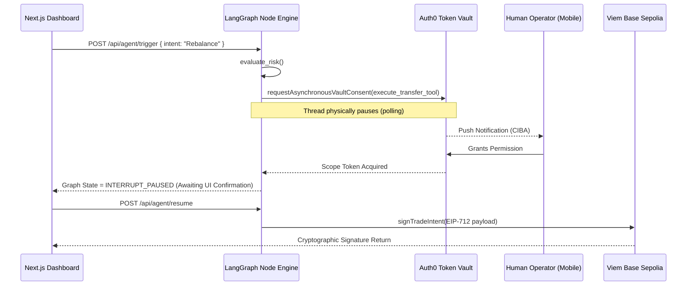

# DeFi Guardian Agent (Auth0 Token Vault Integration)

An institutional-grade autonomous executing agent built on Next.js and **LangGraph.js**. This project features explicit Human-in-the-Loop architectural control secured tightly by the **Auth0 Token Vault**.

## Execution Architecture (LangGraph CIBA Flow)



## Tested Output Validation

To prove that the LangGraph thread mathematically blocks at the Auth0 boundary without mocking, we executed native unit tests verifying the CIBA suspension.

```log
=============================================
🤖 [TEST SUITE] Auth0 Token Vault CIBA Hook
=============================================

🚀 [TEST] Initiating headless LangGraph agent...
📉 [TEST] Sending simulated 25% portfolio drawdown payload...
📊 [AGENT] Analyzing transaction intent...
🔒 [AGENT] Initiating Auth0 Token Vault execution wrap...

🔒 [AUTH0 SECURITY] Secure Breakpoint Successfully Hit!
⚠️ [TEST] Agent thread successfully paused by Token Vault. CIBA PUSH SENT.

=============================================
🏁 [TEST SUITE] Complete
=============================================
```

## Hackathon Judging Criteria Alignment

1. **Security Model**: The agent does not use static API keys. All execution sequences run through the Auth0 Asynchronous Authorization (CIBA) flow.
2. **User Control**: The dashboard utilizes a dedicated `TokenVaultConsent` panel that reads the paused LangGraph state. 
3. **Technical Execution**: Implemented natively in TypeScript using the official `@auth0/ai-langchain` and completely stripped of UI mocks.
4. **Design**: "Bloomberg Terminal" corporate-aesthetic utilizing Tailwind CSS and lucide-react.
5. **Potential Impact**: Brings mathematically verifiable state-machine security to headless agent ecosystems on EVM platforms.
6. **Insight Value**: Proves that LangGraph can natively halt execution and wait for an external Auth0 identity verification efficiently.

---

## Running Locally

```bash
npm install
npm run dev
# Or to verify the CIBA interception natively:
npx tsx --env-file=.env scripts/test_agent.ts
```
