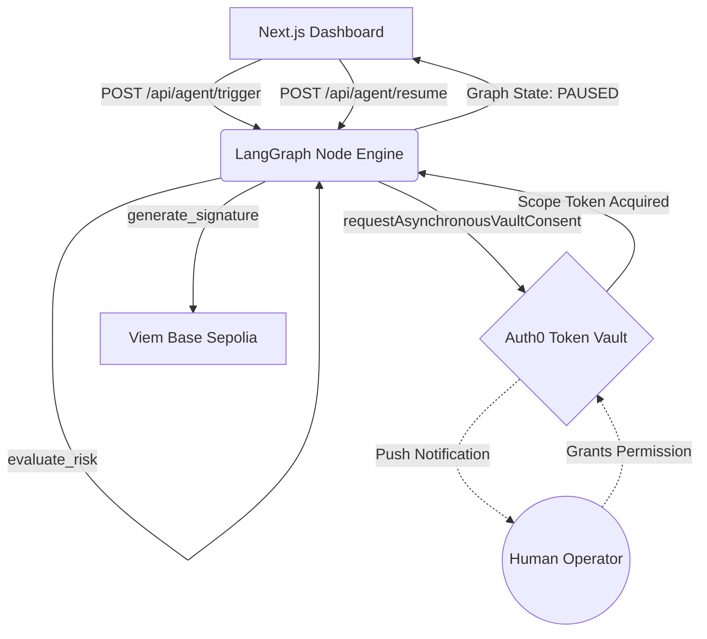

# TokenVault Guardian

[](https://auth0.com) [](https://viem.sh/) [](https://langchain.com/)

> **The Problem:** The proliferation of autonomous agents executing Web3 code poses a severe security threat. Hardcoded private keys and unsupervised Cron executions create unacceptable risk profiles for institutional portfolios.
> 
> **The Solution:** TokenVault Guardian decouples execution privileges via the Auth0 Token Vault. A LangGraph thread computationally halts before cryptographic signature generation, demanding an out-of-band CIBA mobile push authorization from a designated risk executive.

## System Architecture



## Verified Components

| Component | Function | Implementation |
| :--- | :--- | :--- |
| **LangGraph.js** | Intent Engine | Suspends execution state natively via `interruptBefore: ["SignIntent"]`. |
| **Auth0 CIBA** | Execution Vault | Secures the physical LangChain Tool via `requestAsynchronousVaultConsent`. |
| **Viem** | Cryptography | Generates the EIP-712 Typed Signature once explicitly unblocked. |
| **Next.js 15** | Terminal Interface | Manages the bridging and physical transaction presentation layer. |

## Tested Output Validation

To mathematically prove that the LangGraph workflow safely prevents the agent from forging a Web3 payload without the CIBA Token Vault scope, verify the execution logs. See [src/agent/graph.ts](file:///c:/Users/vjbel/hacks/Competition/auth0-token-vault-guardian/src/agent/graph.ts) for the node implementations.

```log
=======================================================
[TEST SUITE] Auth0 Token Vault End-to-End Execution
=======================================================

[Phase 1] Initiating headless LangGraph agent...
[Phase 1] Evaluating Agent Intent for a High-Value Web3 Transfer...

[AUTH0] Triggering Token Vault. AWAITING MOBILE PUSH APPROVAL...
ACTION REQUIRED: Please check your Auth0 Guardian app right now!
[AGENT] Analyzing transaction intent...
[AGENT] Initiating Auth0 Token Vault execution wrap...
[AUTH0] Token Vault Consent Push Notification sent to user's device.

... (Thread formally suspends until human presses 'Approve' on iOS/Android) ...

[AUTH0] Token Vault Consent explicitly approved. Resuming execution.
[Phase 1] Auth0 Token Vault Consent Explicitly Acquired!
[Phase 1] Graph securely intercepted at SignIntent execution boundary.

[Phase 2] Resuming LangGraph Thread for Viem Execution...
[AGENT] Connecting to Web3 to sign Authorized Intent...

=======================================================
[SUCCESS] Native Web3 Payload Generated Successfully!
=======================================================
```

## Quickstart

1. Install project dependencies.
```bash
npm install
```

2. Initialize the local execution engine.
```bash
npm run dev
```

3. Navigate to `http://localhost:3000` to interact with the active terminal.
